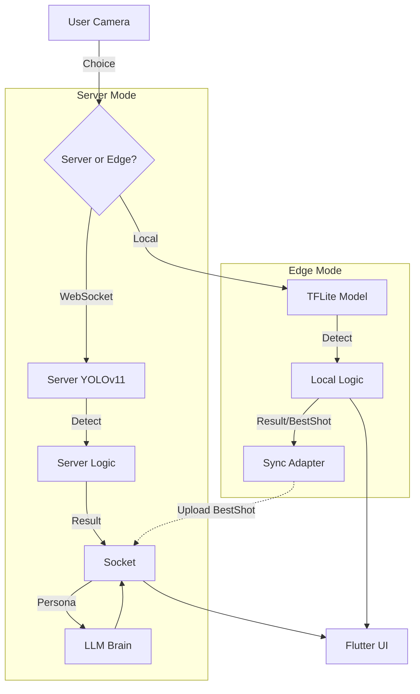

# 📘 Pet Trainer 개발자 가이드 (Technical Manual)

**Pet Trainer** 프로젝트의 기술 구조와 동작 원리를 정리한 문서입니다.
팀원들이 이 문서를 보고 **"반려동물 행동 분석"** 및 **"게임 로직"**을 이해하고 수정할 수 있도록 작성되었습니다.

---

## 1. 🏗️ 프로젝트 전체 구조 (Architecture)

이 프로젝트는 **Flutter (App)**, **Python FastAPI (Backend)**, 그리고 **Vision/LLM AI**로 구성됩니다.

### 📂 핵심 디렉토리 설명

*   **`frontend/lib/`** (앱)
    *   `providers/`: 데이터 관리. 특히 **`training_controller.dart`**가 카메라 영상을 서버로 보냅니다.
    *   `screens/`: UI 화면 (`CameraScreen`, `BattlePage`, `MyRoomPage`).
*   **`backend/app/`** (서버)
    *   **`ai_core/vision/detector.py`**: **핵심!** 욜로(YOLO)로 펫과 물체를 찾고 거리를 계산하는 곳.
    *   **`ai_core/brain/graphs.py`**: 캐릭터가 상황에 맞춰 대사를 생성하는 AI (LangGraph + GPT-4o).
    *   `sockets/`: 실시간 통신 처리 (`socket_service.py`: 훈련용, `battle_socket.py`: 전투용).

---

## 2. � 주요 동작 원리 (Core Mechanics)

### A. 훈련/놀이 모드 (Behavior Detection)
반려동물이 특정 행동(예: 장난감 가지고 놀기, 밥 먹기)을 하는지 **거리와 위치**로 판단합니다.

1.  **[Input]** 앱에서 카메라 프레임을 전송합니다.
2.  **[Vision]** **`detector.py`**가 실행됩니다.
    *   `YOLO(yolo11n.pt)` 모델이 **반려동물(Pet)**과 **타겟 물체(Toy, Bowl, Person)**를 찾습니다.
3.  **[Logic]** 두 물체 간의 관계를 계산합니다.
    *   **거리(Distance)**: 펫과 장난감이 얼마나 가까운가? (`playing`, `interaction` 모드)
    *   **겹침(Overlap)**: 펫이 밥그릇 위에 있는가? (`feeding` 모드)
4.  **[Feedback]** 조건(임계값)을 만족하면 "성공", 아니면 "더 가까이 가세요" 같은 피드백을 보냅니다.
    
### A-2. 엣지 모드 (Edge Training)
서버 통신 없이 폰에서 바로 분석합니다.

1.  **[TFLite]** 폰에 내장된 `.tflite` 모델이 0.1초 안에 반려동물 자세를 찾습니다.
2.  **[Local Logic]** 앱 내부 코드(`edge_detector_native.dart`)가 거리와 각도를 계산합니다.
3.  **[Sync]** 훈련이 성공하면 점수와 베스트 샷(사진)만 나중에 서버로 보냅니다.

### A-3. 자동 추억 생성 (AI Synergy) 📸
**"Vision이 찍고, LLM이 쓴다."**
1.  **[Capture]** 훈련 중 Confidence(확신도)가 가장 높은 프레임을 `Best Shot`으로 선정하여 임시 저장합니다.
2.  **[Upload]** 훈련이 성공적으로 끝나면, 백엔드(`analysis_socket.py`)가 이 사진과 훈련 결과를 받습니다.
3.  **[Captioning]** 서버가 LLM에게 "이 상황(성공, 높은 정확도)에 어울리는 일기 내용을 써줘"라고 요청합니다.
4.  **[Archive]** 사진 + LLM이 쓴 일기가 DB(`diaries` 테이블)에 저장되어 미니홈피에 자동으로 올라갑니다.

> **🛠️ 인식이 너무 빡빡하다면?**
> *   `backend/app/ai_core/vision/detector.py` 파일의 `MIN_DISTANCE`(최소 거리)나 `LOGIC_CONF`(인식 정확도 기준) 값을 수정하세요.

### B. AI 브레인 (Character Persona)
단순한 성공/실패 메시지 대신, 캐릭터가 살아있는 것처럼 말을 넙니다.

1.  **[Trigger]** 훈련 성공, 실패, 또는 마이룸에서 터치 발생 시 호출됩니다.
2.  **[Brain]** **`graphs.py`**가 현재 상황(성공 여부, 스탯, 모드)을 입력받습니다.
3.  **[LLM]** OpenAI GPT 모델이 캐릭터의 성격(페르소나)에 맞춰 대사를 생성합니다.
    *   *예: "주인님! 근육이 더 단단해진 것 같아요! 멍!"*

> **🛠️ 대사 톤을 바꾸려면?**
> *   `backend/app/ai_core/brain/prompts.py`에 있는 시스템 프롬프트(Persona)를 수정하세요.

### C. 실시간 전투 (Battle PvP)
내 펫(데이터)과 상대방(AI/유저)이 턴제로 싸웁니다.

1.  **[Action]** 유저가 '공격'을 누르면 `BattleController`가 소켓 메시지를 보냅니다.
2.  **[Server]** `battle_logic.py`에서 데미지 공식을 수행합니다. (스탯 + 랜덤 요소)
3.  **[Response]** 결과(남은 체력, 크리티컬 여부)를 양쪽에 방송합니다.
4.  **[Visual]** 앱(`BattlePage`)에서 타격 이펙트(Flash)와 진동(Shake)을 재생합니다.

---

## 3. 👩‍� 개발자 가이드 (How-To)

#### Q1. "새로운 훈련 모드(예: '앉아' 훈련)를 만들고 싶어요."
1.  **Backend**: `detector.py`에서 펫의 자세(Pose)를 분석하는 로직을 추가하거나, '특정 구역에 머무르기' 로직을 작성해야 합니다.
2.  **Config**: `pet_behavior_config.py`에 새 모드(`sit_training`) 정의를 추가하세요.

#### Q2. "전투 화면 효과가 너무 심심해요."
1.  **Frontend**: `frontend/lib/screens/battle_page.dart`를 엽니다.
2.  `_listenToEvents` 함수에서 `BattleEventType.crit` (크리티컬) 케이스를 찾습니다.
3.  `_shakeController`의 강도나 지속 시간을 늘리거나, 새로운 애니메이션을 추가하세요.

#### Q3. "캐릭터가 나를 '형님'이라고 부르게 하고 싶어요."
1.  **Backend**: `backend/app/ai_core/brain/graphs.py`를 엽니다.
2.  `generate_message` 함수 내의 **호칭 결정 로직**(`if strength > 50...`)을 수정하거나,
3.  `prompts.py`의 `BASE_PERSONA`에 "너는 사용자를 무조건 형님이라고 불러야 해"라고 적으세요.

---

이 문서를 통해 프로젝트의 흐름이 파악되셨나요?
모르는 부분이 있다면 **코드의 파일명**을 확인하고 해당 파일로 이동해 보세요! 🚀
