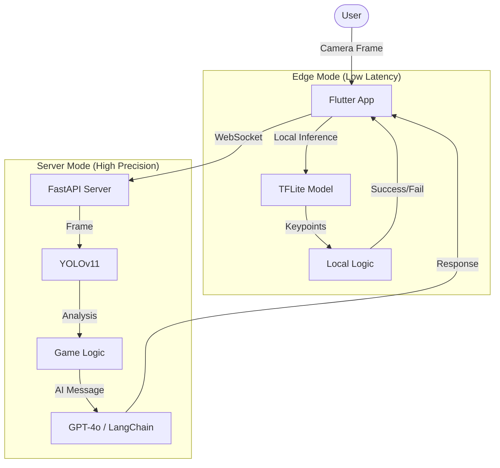
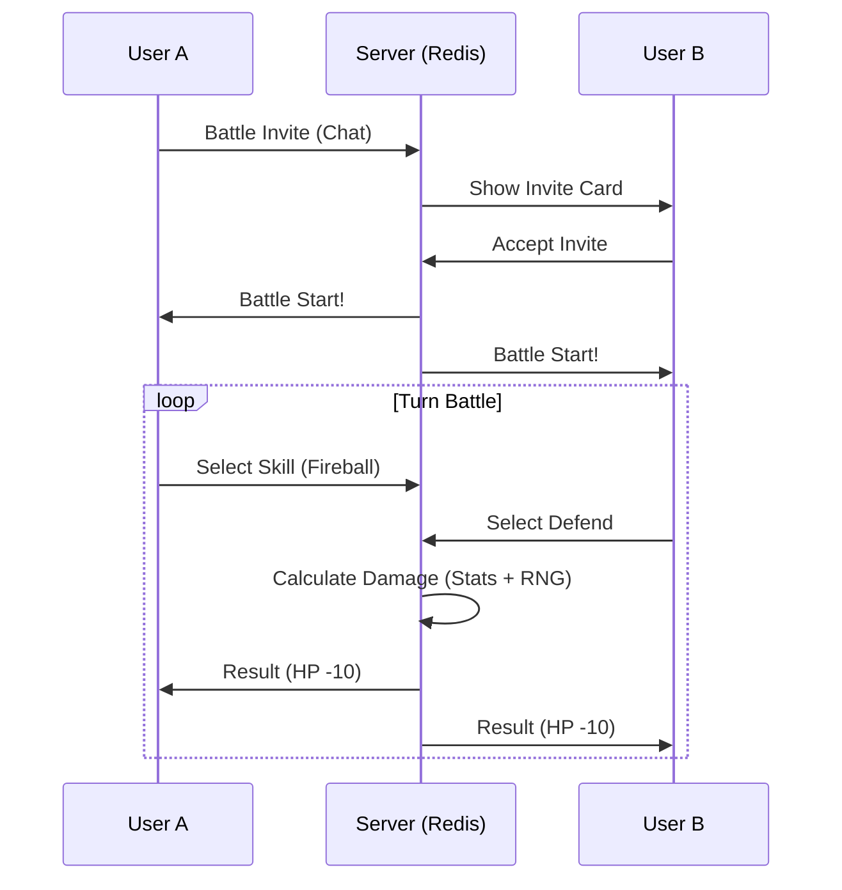

# 🐶 펫트레이너 (Pet Trainer): AI 기반 반려동물 육성 및 커뮤니티 플랫폼

> **"우리집 강아지, AI로 똑똑하게 키우고 게임처럼 즐긴다!"**  
> 실시간 **AI 비전(Vision)** 기술로 반려동물의 행동을 인식해 훈련하고, 성장한 캐릭터로 다른 유저와 **배틀** 및 **소통**하는 올인원(All-in-One) 플랫폼입니다.

---

## 🌟 프로젝트 소개 (Overview)

**펫트레이너**는 단순한 행동 인식 앱을 넘어, **'훈련(Training) -> 육성(RPG) -> 커뮤니티(Social)'**로 이어지는 순환 구조를 가진 게이미피케이션(Gamification) 프로젝트입니다.

*   **AI Vision**: YOLOv11(서버) 및 TFLite(엣지)를 활용한 하이브리드 포즈 인식.
*   **AI Persona**: 훈련 결과에 따라 캐릭터가 살아있는 듯한 대사를 건네는 LLM 기반 페르소나.
*   **Social & Battle**: 미니홈피(방명록/일기)와 실시간 1:1 PVP 배틀 시스템.

---

## 🚀 핵심 기능 (Key Features)

### 1. 하이브리드 AI 훈련 (Hybrid AI Training) 🧠
서버 비용 절감과 반응 속도 최적화를 위해 **두 가지 모드**를 지원합니다.
*   **서버 모드 (Server Mode):** 고성능 GPU 서버(YOLOv11)에서 정밀한 분석 수행 (복잡한 행동).
*   **엣지 모드 (Edge AI Mode):** 인터넷 없이 기기 내(On-Device TFLite)에서 0.1초 내 즉각 반응 (단순 행동).
*   **베스트 샷 (Best Shot):** 훈련 성공 순간을 AI가 자동으로 포착하여 사진첩에 저장.

### 2. 실시간 PVP 배틀 (Real-time Battle) ⚔️
내 펫의 스탯(근력, 지능, 민첩)을 기반으로 다른 유저의 펫과 대결합니다.
*   **초대 시스템:** 채팅창에서 바로 '대결 신청'을 보내고 수락하면 전투 화면으로 전환.
*   **턴제 전략:** 공격/방어/스킬 선택에 따른 심리전 및 화려한 스킬 이펙트.
*   **속성 상성:** 물 > 불 > 풀 등 포켓몬 스타일의 상성 및 상태이상(기절, 출혈) 시스템.

### 3. 미니홈피 & 커뮤니티 (Mini-Homepage) 🏠
싸이월드 감성의 **마이룸/미니홈피** 시스템을 제공합니다.
*   **다이어리:** 훈련 중 찍힌 '베스트 샷'을 공유하고 좋아요/댓글 소통.
*   **방명록:** 친구의 미니홈피에 놀러가서 안부 글 남기기.
*   **펫 스탯 관리:** 육각형 차트(Radar Chart)로 성장 현황 한눈에 확인.

### 4. AI 기술 융합 전략 (AI Synergy Strategy) 🔗
**YOLO (Vision)**와 **LangGraph (LLM)**의 결합으로 유저의 행동을 소셜 콘텐츠로 자동 변환합니다.
*   **자동 추억 생성:** 훈련 중 베스트 샷(YOLO)과 상황에 맞는 감성 멘트(LLM)가 결합되어 미니홈피 다이어리에 자동 업로드됩니다.
*   **소셜 리텐션 루프:** 유저는 단순히 앱을 즐기기만 해도 반려동물과의 추억이 쌓이며, 이 고품질 데이터는 친구들에게 자랑거리가 되어 앱 재방문(Retention)을 유도합니다.

### 5. 실시간 채팅 (Live Chat) 💬
*   웹소켓(WebSocket) 기반의 끊김 없는 실시간 대화.
*   배틀 초대장 발송 및 시스템 알림 통합.

### 6. 관리자 페이지 (Admin Dashboard) 🛠️
*   `SQLAdmin`을 활용한 백엔드 관리자 대시보드.
*   유저 관리, 신고 처리, 게임 데이터(아이템/스킬) 실시간 수정 가능.

---

## 🛠 기술 스택 (Tech Stack)

### Frontend (Mobile App)
| Category | Stack | Description |
| --- | --- | --- |
| **Framework** | **Flutter** | Cross-platform (iOS/Android) 개발 |
| **State Mgt** | **Provider** | 효율적인 전역 상태 관리 및 의존성 주입 |
| **AI (Edge)** | **TFLite (`tflite_flutter`)** | 온디바이스 추론을 위한 경량화 모델 탑재 |
| **Network** | **WebSocket (`web_socket_channel`)** | 실시간 이미지 스트리밍 및 채팅 구현 |
| **Chart** | `fl_chart` | 레이더 차트 등 데이터 시각화 |
| **Media** | `camera`, `video_player` | 실시간 카메라 제어 및 프리뷰 |

### Backend (Server & AI)
| Category | Stack | Description |
| --- | --- | --- |
| **Framework** | **FastAPI** | 고성능 비동기(Async) Python 웹 프레임워크 |
| **Vision AI** | **Ultralytics YOLOv11** | 최신 객체 탐지 및 포즈 추정 모델 |
| **LLM AI** | **LangChain / LangGraph** | 컨텍스트 인식 대화(페르소나) 생성 |
| **Database** | **PostgreSQL** | 관계형 데이터 저장 (유저, 게임 데이터) |
| **ORM** | **SQLAlchemy (Async)** | 비동기 DB 처리로 동시성 확보 |
| **Cache** | **Redis** | 실시간 전투 상태 저장 및 빠른 조회 |
| **Admin** | **SQLAdmin** | 간편한 백엔드 데이터 관리 인터페이스 |

### Infrastructure & DevOps
*   **Docker & Docker Compose:** 컨테이너 기반의 일관된 배포 환경 구성 (Web + DB + Redis).
*   **AWS / Cloud (Planned):** 클라우드 배포 예정.

---

## 🏛 시스템 아키텍처 (Architecture)

### 1. Hybrid Vision Pipeline


### 2. Battle System Flow


---

## 🎨 UI/UX Highlights

*   **직관적인 피드백**: 훈련 성공 시 폭죽 효과 및 즉각적인 오디오 피드백 제공.
*   **감성적인 디자인**: 둥글고 귀여운 폰트(Jua/Gasoek)와 파스텔 톤 색감으로 친근감 형성.
*   **Seamless Interaction**: 채팅 중 초대장을 누르면 즉시 배틀 로비로 이동하는 끊김 없는 경험(Navigation).

---

## 📂 디렉토리 구조 (Directory Structure)

```bash
pet_trainer/
├── backend/                  # Python FastAPI Backend
│   ├── app/
│   │   ├── ai_core/          # AI Logic (Vision, LLM)
│   │   ├── game/             # Battle Logic & Assets
│   │   ├── api/              # Restful API Endpoints
│   │   └── sockets/          # WebSocket Handlers (Chat, Training, Battle)
│   └── ...
│
├── frontend/                 # Flutter Frontend
│   ├── lib/
│   │   ├── screens/          # UI Pages (MyRoom, Battle, Chat, Camera)
│   │   ├── providers/        # State Management (ChatProvider, TrainingProvider)
│   │   ├── widgets/          # Reusable Widgets
│   │   └── services/         # API & Socket Services
│   └── assets/               # Models(.tflite), Images, Fonts
│
└── edge_ai/                  # AI Model Files & Conversion Scripts
```

---

## 📝 설치 및 실행 (Getting Started)

### Prerequisites
*   Docker & Docker Compose
*   Flutter SDK (3.0+)
*   Python 3.10+

### 1. Backend Launch
```bash
cd backend
# .env 파일 설정 후
docker-compose up --build
```

### 2. Frontend Launch
```bash
cd frontend
flutter pub get
flutter run
```

---

## 👨‍💻 License & Credits
*   **Project Lead**: Yang (Full Stack & AI)
*   Build with ❤️ using Flutter & FastAPI.
